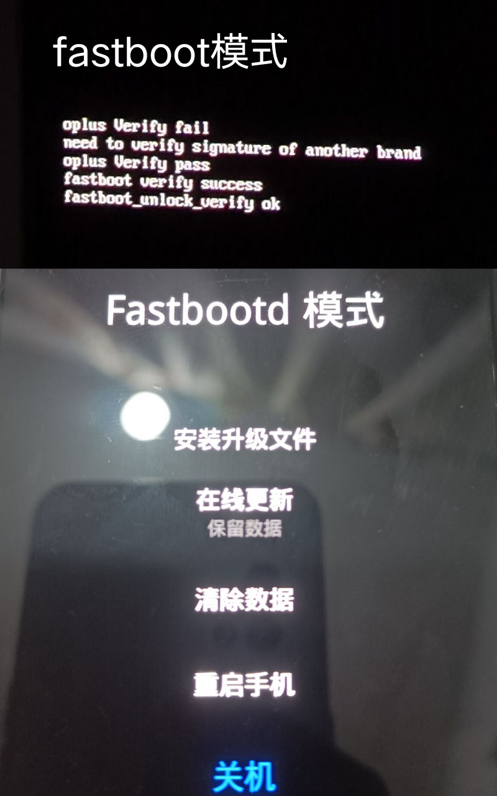

# realme Q2 fastboot线刷包
## 关于
- 作者：洋葱落叶
- 版本：A.33 (realme UI 1.0)

如果您转载本人制作的线刷包，请务必保留原作者信息

本线刷包遵循CC BY-NC-SA 4.0协议

> 注意：使用此线刷包前，请务必解锁Bootloader

请务必在fastboot模式（只有几行英文）下刷入。

请勿在fastbootd模式（有图形界面）下刷入，否则会出现部分底层分区无法刷入的情况

### fastboot进入方法（不适用于变砖后卡第一屏的情况）
- 方法①：连接手机，输入adb命令：adb reboot bootloader

- 方法②：关机并等待15秒，长按电源键和音量-，出现震动后松手

## 校验码

MD5：1C44824859F1E1F9A2294362BF6A068A

CRC-32：32811B6F

SHA-1：7F53499525901C7C937C3FBB8CECAAB71501E174

SHA-256：001AF3A41C97B714435A9EEE6EF14F7E1AB1B8B1B0D467093BB8673FFDD908BD

## 下载地址
[OneDrive](https://dljz-my.sharepoint.com/:f:/g/personal/ycly_nii_ink/EsKg7412dwBBkJFlSLUF1l4BCIGefRBBsGZfy40vmLEOnA?e=YWh3s1)

> 如果无法打开下载链接，请挂梯后再重试

> 如果使用第三方下载器下载，请务必使用下载器内置浏览器打开OneDrive链接
